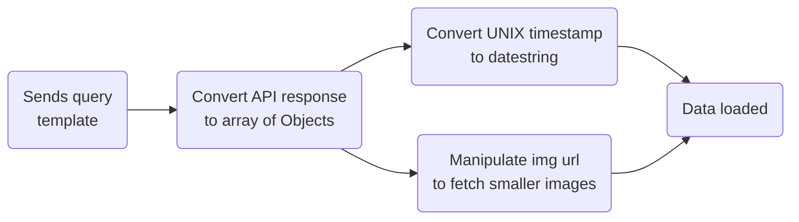

# Trustana Front-end Engineer Assignment

## Task 3 - GraphQL

1.  Hardcoded data in the webpage will be replaced with data loaded from a GraphQL API endpoint.
    1.  We want to display a list of past Space X launches.
    2.  The list of past Space X launches will be categorised based on the launch site name.
2.  Data will be retrieved via the SpaceX Land GraphQL API: <https://github.com/spacexland/api>
3.  There will be 3 tabs, each containing past launches from the following launch sites:
    1.  CCAFS SLC 40
    2.  VAFB SLC 4E
    3.  KSC LC 39A
4.  Each item will contain the following information:
    1.  A photo of the launch (if available)
    2.  The launch mission name
    3.  Date & time of the launch
    4.  The name of the rocket used
5.  Each tab will contain up to 10 items, there is no need to display the remaining items.

#### Bonus Tasks

These tasks are completely optional, however, you may attempt them as a challenge 🤓

1.  Implement pagination to display more than 10 items per category.
2.  Implement sorting to sort the items displayed.
3.  Save the application state so that when the user visits the page again, it remembers which tab/page/sort they are on.

## Demo

https://trustana-assignment-task3-nwb.netlify.app

## Task approach

Components from task-2 are reused, with only modificatons to props. Added Pagination components and an API fetch service helper.

### Implementation

#### Flow of consuming API

As per the task requirement, the launch site name needs to be a query filter. However, spaceX API only accepts a string for the filter which means there needs to be mutliple identical queries with different arguments. To achieve this, aliases needs to be used such that results of different data can be stored.

A template comprising an array of objects containing an alias, site name and data limits is used to create a query string. This appproach enables one to scale requests dynamically instead of hard-coding the queries.

#### Pagination

As part of the bonus challenge, pagination is added. The pagination component logic is separated from the rendering of the card items and it only controls the page number. While the tab component slices the array containing the list of card items according to the current page number.

#### UI

1. The only new UI component is the pagination. Similar to the tab bar, it is a map of buttons in a row that sets the current page index via the useState hook.

2. As some launches have missing images, a spaceX logo placeholder will be shown as the fallback image.

#### Optimization

Images given by the API are in original size with the "\_o" tag at the end which are too large for the Card size. Those tags are changed to a "\_w" tag to fetch smaller sized images, resulting in much faster loading speeds.

#### Task fulfillment

- ✅ ReactJS
- ✅ CSS (Without framework)
- ✅ TypeScript
- ✅ Retrieve data from SpaceX Land GraphQL API
- ✅ Render tabs and its contents containing details of past launches
- ✅ Mobile responsive
- ✅ Bonus Tasks (Pagination only)

Create-React-App toolchain is used to setup the project skeleton.
