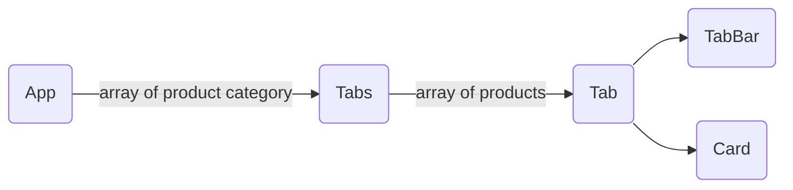

# Trustana Front-end Engineer Assignment

## Task 1 - User Interface

1.  Create your ReactJS project.
2.  Build the webpage as shown in the Figma mockup.
3.  Create a mock data object based on the content in the Figma mockup.
    1. There are no items in the second and third tabs.
4.  ⚠️ Note: You're not allowed to use any JS libraries or CSS frameworks for the Tabs component, meaning the styling and logic should be written from scratch.
5.  Tabs logic:
    1.  Clicking on each tab will show the respective items in each category.
    2.  The first tab is always selected by default on load.
6.  The webpage is meant to be displayed on a desktop/laptop computer (minimum 1280px width).

## Demo

https://trustana-assignment-task1-nwb.netlify.app

## Task approach

Adopting React principles, two components were identified to be reusable. Namely...

1. A tab button with a tab content, both contained in a container of sorts.
2. A card component consisting of the required info contained inside the tab content container.

### Implementation

#### Structure

1. Mock JSON data flows from the root level to the Tabs component.
2. The Tabs component iterates through an array of product category (Korean, Japanese...) Objects and creates a Tab component, passing along the array of items in the category.
3. In the Tabs component, the current active tab state is set with a useState hook and its setState function reference is passed down to the TabBar component for onClick triggers.
4. Similarly, Card components are rendered iteratively based on the received array of items.

#### UI

Tab bar is made up of an unordered list of buttons, flexed in a row. At onClick, the button calls the setState function and the tab window re-renders with the new tab.

#### Task fulfillment

- ✅ ReactJS
- ✅ CSS (Without framework)
- ✅ TypeScript
- ✅ First tab default on load
- ✅ Compatible with desktop screens
- ❌ Bonus Tasks

Create-React-App toolchain is used to setup the project skeleton.
